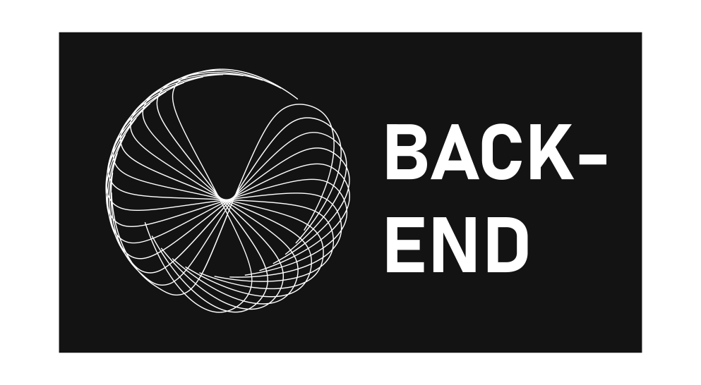

HarmonyHub
===================

Welcome to HarmonyHub, your free and easy-to-use digital audio workstation (DAW) designed to bring your musical creativity to life right in your web browser.

What is HarmonyHub?
-------------------
HarmonyHub is a web-based DAW created to empower music enthusiasts and students to make music effortlessly. No more steep learning curves, and definitely no more breaking the bank to get started on your musical journey. Here's what HarmonyHub is all about:
*   **Beginner-Friendly:** Music software can be intimidating. HarmonyHub offers a simple and intuitive interface, making it a breeze for newcomers to dive into music creation.
*   **Real-Time Collaboration:** Create music with your friends or fellow music lovers through temporary session codes. It's as easy as sharing a link and jamming together, no matter where you are.
*   **Built-in Synthesizer:** HarmonyHub includes a powerful synthesizer with features like velocity, pan, fine-tuning, echo, and envelope modulation. Your creativity knows no bounds.
*   **Web-Based:** No downloads or installations required. HarmonyHub is accessible directly from your web browser.
*   **No Strings Attached:** We're not here to nickel-and-dime you. HarmonyHub is free, with no subscriptions, ads, or hidden fees. **And it always will be.**


Why HarmonyHub?
---------------
Existing music software can be daunting and expensive. We've taken inspiration from the best and created a DAW that combines the simplicity of BeepBox with the capabilities of LMMS, making it perfect for both beginners and those looking for a user-friendly experience.

Getting Started
---------------
Ready to make music? Just visit our website, and you can start creating, collaborating, and having fun right away. No account creation required; just hop in and let the music flow.
Otherwise, you are also able to run HarmonyHub locally on your machine. To do so, you need to have **Node.js**, **cmake** and **make** installed. Then, you can clone this and the [server](https://github.com/HarmonyHub-DAW/HarmonyHub-Server) repository and run the following commands in the root directory of each of the projects:
```bash
# Frontend
$ npm install
$ npm run dev

# Backend
$ cd build
$ cmake ..
$ make
$ ./HarmonyHub
```

Milestones
----------
We're committed to delivering the best music-making experience, and here are some of the key milestones we've set for HarmonyHub:

*   **Web Application Implemented:** October 1, 2023
*   **Interface Up and Running:** November 15, 2023
*   **Saving and Loading Data Executed:** November 25, 2023
*   **Synthesizer Version Finalized:** November 30, 2023
*   **Collaboration in Backend Implemented:** December 1, 2023
*   **Connection Between Users Established:** December 15, 2023
*   **Project Approved:** January 16, 2024